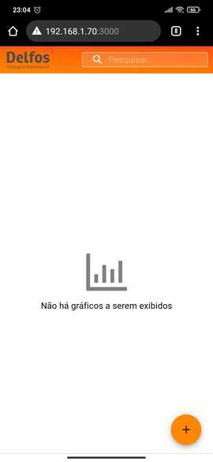
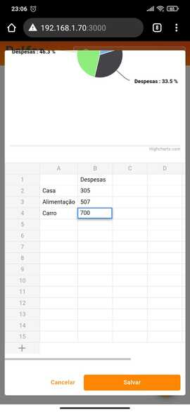
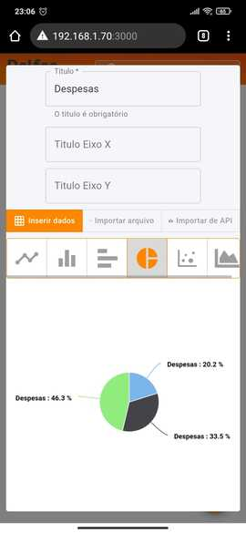
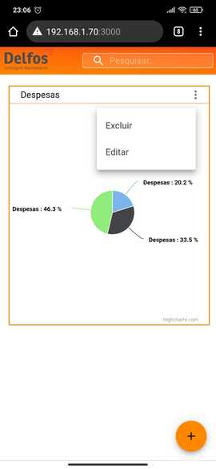

# Desafio Front-end Delfosim
> Desafio para ingressar como Front-end Developer na Delfosim em Fortaleza-CE

## Sobre o desafio
Não será passado prazo para entrega, verifique os pré-requisitos e nos dê seu prazo, mas fique atento pois vamos avaliar mais rigorosamente seu código quanto mais demorar para entregar a partir da data em que foi feito o fork desse repositório. A ideia é simples, você terá que desenvolver (com dados falsos) seguindo os pré-requisitos e o seguinte layout:


## Ações
- O usuário deve ser capaz de incluir um novo widgets(Gráfico), editar e remover
- No momento da inclusão desse widgets o usuário deve fornecer os valores falsos e na edição o mesmo deve alterar os valores cadastrados
- Todos esses widgets devem ser listados no Dashboard


## Pré requisitos
- ReactJS
- Utilize desses UI Frameworks ([Bootstrap](https://react-bootstrap.github.io/), [Semantic](https://react.semantic-ui.com/) ou [Material](https://material-ui.com/pt/))
- Documentar como rodamos servidor do projeto no README.MD

## Dicas
- React Router
- Highcharts

## Diferenciais
- Código bem escrito e documentado
- Arquivos pequenos com poucas responsabilidades
- Redux
- Boa usabilidade
- Feedback para o usuário no carregamento da consulta
- Layout flexível (Flexbox)
- Utilizar as novas features do ECMA

## Pronto para começar o desafio?
- Faça um "fork" desse repositório na sua conta do Github
- Crie uma branch com o seu nome e sobrenome ex: ```lucas-franca```
- Após completar o desafio, crie um "pull request" nesse repositório comparando a sua branch com a master
- Receberemos uma notificação do seu pull request, faremos a correção da sua solução e entraremos em contato com o email da conta do github em que foi executada o desafio

## FAQ
- Posso usar o create-react-app para completar o desafio?

**Sim, você pode usar qualquer cli para criar seu projeto**

- Preciso necessariamente fazer um fork do projeto?

**Sim, para que possamos saber quanto tempo você levou para executar o desafio**

- Aonde estão os assets?

**Esse desafio não te dá nenhum asset, você terá que buscá-los por conta própria**

- Tenho mais dúvidas, com quem posso entrar em contato?

**Entre em contato com André Oliveira (andre.oliveira@delfosim.com)**

## Como rodar o servidor do projeto
Projeto desenvolvido utilizando principalmente os framework Material-UI e Redux.

O primeiro passo para colocar o projeto para rodar é instalar as dependências 

``` 
cd frontend-test-01
npm install
```

feito isso, basta subir a aplicação em _development mode_

``` 
npm start
```

ou compile o aplicativo para produção na pasta de compilação utilizando

``` 
npm run build
```

## Funcionalidades

**Novo Widget**

- Para criar um widget inserindo dados manualmente basta preencher a tabela com as representações.


**Importando dados de arquivo**

- É possível também criar um widget importando dados de arquivos JSON ou CSV.


**Importando dados de API**

- Se preferir, é possível importar dados de duas APIs gratuitas (Covid-19 nas regiões de um país ou últimas 1000 transações envolvendo Bitcoin). Observação sobre API Covid-19: períodos de dias acima de 1 mês costumam gerar _timeout_. 


**Filtrar Widgets**

- Para filtrar um Widget dentre os demais basta digitar o partes ou o nome completo do titulo do widget.


**Editar Widgets**

- Para editar um Widget basta selecionar a opção no menu superior direito. Todas as funcionalidades de criação de widgets também estão presentes nesta tela.


**Excluir Widgets**

- Para excluir um Widget basta selecionar a opção no menu superior direito.


**Alterar tipo de gráfico**

- É possível alternar o tipo de gráfico entre seis possibilidades.


## Responsividade

Screenshots da aplicação acessada por smartphone.





